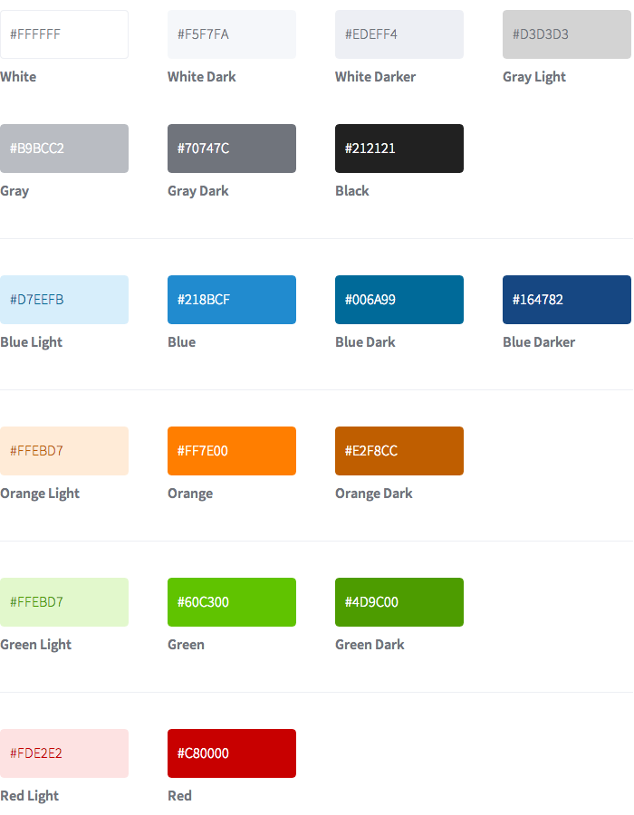

Wimdu Resources
=======

Wimdu logos, icons, and press related assets - http://wimdu.com

## Typography:

Wimdu uses the `Source Sans Pro` typeface, which can be downloaded for free here:
http://www.google.com/fonts/specimen/Source+Sans+Pro

(Source files are available here: https://github.com/adobe/source-sans-pro)

## Colors

## Icon

Available formats:

* **Vector**: svg, eps, pdf
* **Raster**: png

## Icon + Text

Available formats:

* **Vector**: svg, eps, pdf
* **Raster**: png